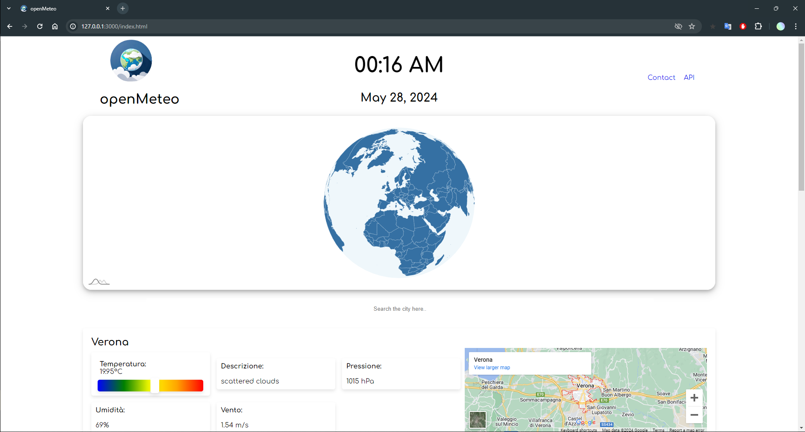
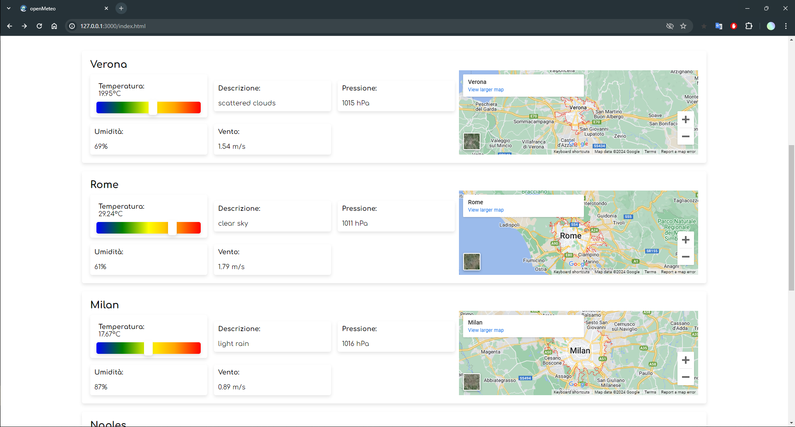
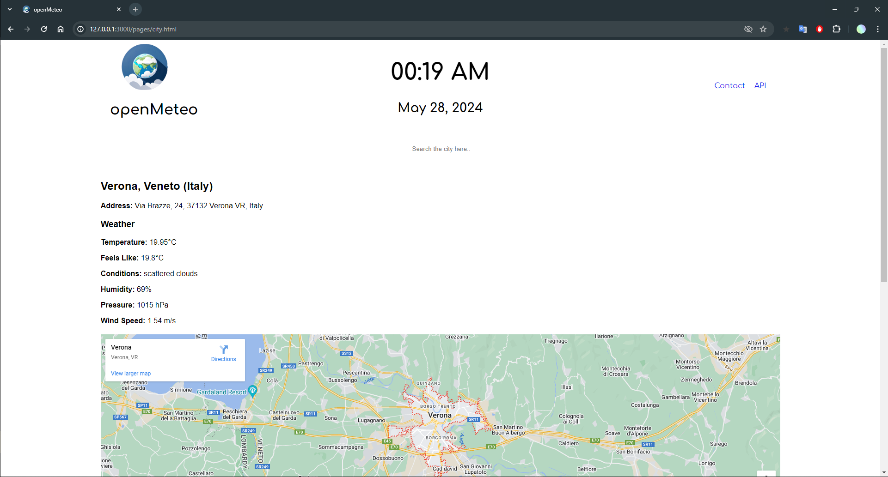
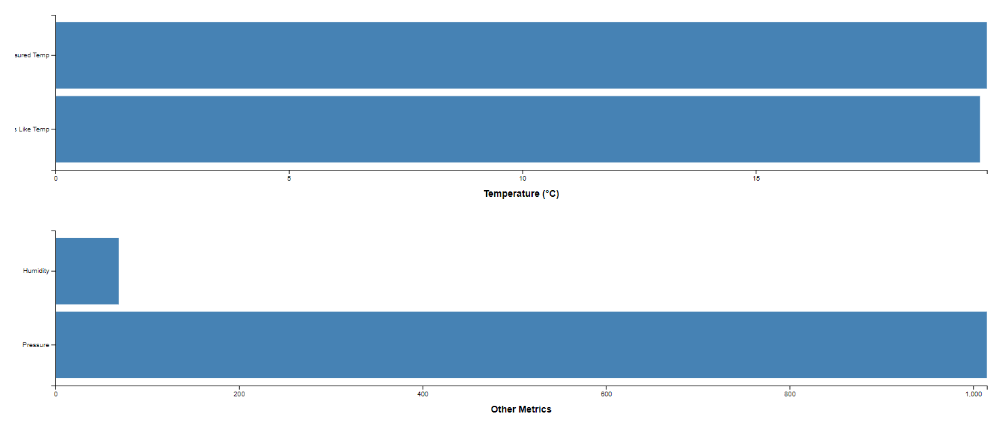

# **OpenMeteo**

## **Description**

The **OpenMeteo** project, developed by students **Matteo De Donno** and **Giovanni Montresor**, is a web application that provides a weather interface through the use of public APIs. During the project, we used **JavaScript** programming languages and **HTML** and **CSS**  markup languages. Additionally, we employed **Node.js** , a runtime environment that allows you to run server-side JavaScript code, to manage the backend. This project allowed us to delve deeper into the study of data structures.

## **Use of the app**

The OpenMeteo app is a ***weather application*** featuring a globe on the homepage, allowing users to ***select*** countries. The default country upon loading is Italy, with its main cities listed below. Additionally, users can conduct more detailed searches for individual cities and view their respective weather data.

## **Technologies**

Front End:

- **CSS**
- **HTML**
- **JavaScript**

Beck End:

- **node.js**

## Front End Examples

**HOME:**

---

**MAIN CITIES OF THE COUNTRY SELECTED:**

---

**CITY DETAILED DATA:**

---

**GRAPHS:**

## **Authors**

- ***Matteo De Donno***
- ***Giovanni Montresor***
